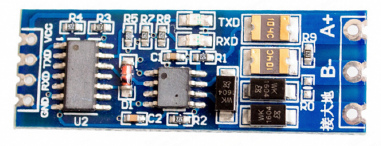
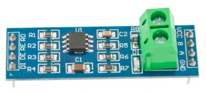

# ESPHome компонент для подключения счетчиков электроэнергии Энергомера CE102M CE207 CE208 CE301 CE303 CE307 CE308 по RS-485 (ГОСТ МЭК/IEC 61107-2011)

* [1. Назначение](#1-назначение)
* [2. Отказ от ответственности](#2-отказ-от-ответственности)
* [3. Функции](#3-функции)
* [4. Пример отображения в home-assistant](#4-пример-отображения-в-home-assistant)
* [5. Подключение](#5-подключение)
* [6. Настройка основного компонента](#6-настройка-основного-компонента)
* [7. Настройка сенсоров для опроса счетчика](#7-настройка-сенсоров-для-опроса-счетчика)
* [8. Примеры готовых конфигураций](#8-примеры-готовых-конфигураций)
* [9. Проблемы, особенности, рекомендации](#9-проблемы-особенности-рекомендации)

## 1. Назначение
Компонент для считывания данных с электросчетчиков, поддерживающих протокол МЭК/IEC 61107, таких как Энергомера СЕ102М, СЕ301, СЕ303. 
Потенциально, может работать и сдругими счетчиками поддерживающими данный ГОСТ. Кроме того, работает и с некоторыми счетчиками Энергомера,
заявленными как СПОДЭС (SPds в названии - например *CE207-R7.849.2.OA SPds*). Проверено на нескольких CE207, СЕ208, СЕ307, СЕ308.

## 2. Отказ от ответственности
Пользуясь данным ПО пользователь полностью берет на себя всю ответственность за любые последствия.
 
## 3. Функции
- подключение как безадресное (широковещательный запрос), так и по адресу (9 последних цифр заводского номера),
- индивидуальна настройка сенсоров под конкретные запросы,
- работа с массивом возвращаемых значений,
- два вида сенсоров: числовой и текстовый,
- работа только на скорости 9600 бод,
- также будет работать через оптопорт, если он поддерживает начальную скорость 9600 бод

## 4. Пример отображения в home-assistant
 

## 5. Подключение
Устройства:
- микроконтроллер Esp (работа провена на модулях на базе esp32, esp32s, esp32s2, esp8266)
  - если испольуется UART0, то в модуле логгера нужно отключать вывод в порт (baud_rate:0)
- модуль трансивера RS485,
  - должен быть расчитан на 3.3 вольта (связка Esp + модуль на max485 расчитаный на 5 вольт может работать некорректно)
  - запитываем либо от esp модуля, либо отдельно, земля общая
- счетчик электрической энергии (работа проверена со счетчиками Энергомера СЕ102М, СЕ301 версии CE301v11.8s4, СЕ303 версии CE303v11.8s4)
  - A+ и B- соединяем с модулем
    - желательно подключение витой парой (А и В переплетены между собой) 
    - земли счетчика и модуля 485 *не соединяем*, а если кабель с экраном/оплеткой - можно соеденить с землей только со стороны модуля для уменьшения наводок
    - если расстояние до счетчика большое, то может понадобиться терминирующий резистор 120 Ом между A и B
  - CE301/CE303 в корпусах R32/R33 - необходимо отдельно подавать питание 9-12 вольт на клеммы V+, V-.
  - пользуемся документацией на счетчик для уточнения схем подключений
  
### 5.1 Рекомендуемый вариант подключения с RS-485 модулем с автоматическим выбором направления передачи 
На данный момент в продаже много модулей RS-485 с расширеным набором функций - с логикой автоматического выбора направления передачи, защитными диодами и предохранителями. 
Эти модули рекомендуются к использованию, т.к. более надежны.  
Например, модуль XY-017


```
┌───────┐           3.3В     ┌─────────────┐                 ┌────────────────┐
│       │            └── VCC ┤             │                 │                │
│  MCU  ├ RX ──────────── RX ┤ RS485<->TTL ├ A ───┐─┐─┐─── A ┤ Электросчетчик │
│ ESPxx ├ TX ──────────── TX ┤   module    ├ B ───└─└─└─── B ┤                │
│       │                    │             │                 │                │
│       │                    │             │          ┌─── + ┤                │
│       ├ GND ────────── GND ┤             │      9-12В ── - ┤                │
└───────┘                    └─────────────┘                 └────────────────┘
```
Иногда RX/TX на модуле перепутаны - ничего страшного, просто меняем.

### 5.2 Вариант подключения с классическим RS-485 модулем с 4 входами
Классический модуль с RO/DI/DE/RE входами + общая земля. MAX485 расчитан на 5В, а MAX3485 на 3.3В, хотя первый в 90% случаев прекрасно работает и от 3.3В тоже.

- ``RO`` - прием, 
- ``DI`` - передача, 
- ``DE + R̅E̅``  - контроль линии для передачи данных (`flow_control_pin` в yaml) 



```

┌───────┐           3.3В     ┌─────────────┐                 ┌────────────────┐
│       │            └───VCC ┤             │                 │                │
│  MCU  ├ RX ──────────── RO ┤ RS485<->TTL ├ A ───┐─┐─┐─── A ┤ Электросчетчик │
│ ESPxx ├ TX ──────────── DI ┤   module    ├ B ───└─└─└─── B ┤                │
│       ├ FLOW ──────┬─── RE ┤             │                 │                │
│       │            └─── DE ┤             │          ┌─── + ┤                │
│       ├ GND ────────── GND ┤             │      9-12В ── - ┤                │
└───────┘                    └─────────────┘                 └────────────────┘
```

## 6. Настройка основного компонента
Подлючаем внешний компонент из репозитория
```
external_components:
  - source: github://latonita/esphome-energomera-iec
    refresh: 30s
    components: [energomera_iec]
```
Конфигурируем UART 9600 7E1:
```
uart:
  rx_pin: GPIO16
  tx_pin: GPIO17
  baud_rate: 9600
  data_bits: 7
  parity: EVEN
  stop_bits: 1
```

Основной модуль
```
energomera_iec:
  id: ce102m
  update_interval: 30s
#  address: 123456789
#  receive_timeout: 500ms         # время ожидания ответа от счетчика
#  delay_between_requests: 100ms  # задержка между запросами к счетчику
#  flow_control_pin: GPIO32
```
- `address` - по-умолчанию пустой, если счетчик один - то адрес не требуется. Если несколько счетчиков - то там указываем его адрес - это последние 9 цифр его заводского номера.
- `receive_timeout` - по-умолчанию 500мс, если ответы длинные - то можем не успеть дождаться ответа - увеличиваем.
- `delay_between_requests` - по-умолчанию 100мс, иногда счетчик может тупить после больших запросов и не успевает принять новый - увеличиваем. **важно** - больше 1.5с не рекомендую, в счетчиках есть таймаут от 1.5с до 3с - если их не дергают, они считают, что общение закончено и закрывают сессию.
- `flow_control_pin` - указываем, если 485 модуль требует сигнал направления передачи RE/DE 

## 7. Настройка сенсоров для опроса счетчика
Реализованы два типа сенсоров:
- `sensor` - числовые данные, float
- `text_sensor` - текстовые данные в формате "как пришли от счетчика"
```
sensor/text_sensor:
  - platform: energomera_iec
    name: Название сенсора
    request: ЗАПРОС()
    index: индекс ответа, по-умолчанию 1
    sub_index: суб-индекс внутри ответа, по-умолчанию 0 = весь ответ из скобок
    ... остальные стандартные параметры для сенсора ...
```

Названия функций для запроса берем из документации на счетчик. Если запрос возвращает несколько значений, то, по-умолчанию, берется первое, но можно выбрать указав номер ответа (индекс, начинается с 1). Если в скобках указано несколько значений через запятую, то
можно указать какое именно брать (суб-индекс, начинается с 1).
Примеры запросов и ответов от счетчика:
| Счетчик | Запрос | Ответ счетчика | Индекс | Суб-индекс | Результат |
|--|--|--|--|--|--|
| CE102M    | `VOLTA()` | `VOLTA(228.93)`| не указан | не указан | 228.93 |
| CE301/303 | `VOLTA()` | `VOLTA(228.93)VOLTA(230.02)VOLTA(235.12)` | не указан | не указан | 228.93 |
| CE301/303 | `VOLTA()` | `VOLTA(228.93)VOLTA(230.02)VOLTA(235.12)` | 1 | не указан | 228.93 |
| CE301/303 | `VOLTA()` | `VOLTA(228.93)VOLTA(230.02)VOLTA(235.12)` | 2 | не указан | 230.02 |
| *, кроме СПОДЭС         | `ET0PE()` | `ET0PE(34261.8262567)(25179.1846554)(9082.6416013)(0.0)(0.0)(0.0)` | 2 | не указан | 25179.1846554 |
| CE307/308 | `EMD01(0.0,1)` | `EMD01(20.08.24,0.45991)(0.41342)` | 1 | 2 | 0.45991 |
| CE307/308 | `EMD01(0.0,1)` | `EMD01(20.08.24,0.45991)(0.41342)` | 2 | не указан | 0.41342 |

Запросы берем из руководств на счетчики. Например, [Руководство по эксплуатации CE102M](http://sp.energomera.ru/documentations/product/ce102m_re_full.pdf) , или 
[Руководство пользователя CE301 и CE303](http://sp.energomera.ru/documentations/product/ce301_303_rp.pdf).

Кроме того, оказалось, что некоторые СПОДЭС счетчики Энергомера (например, 307 и 308, и, возможно, также 207 и 208) тоже уверенно
отвечают на запросы по стандарту МЭК, но с некоторыми особенностями. Например, там не работает команда `ET0PE` для получения накопленной
энергии. Вместо этого можно использовать команды работы с архивом `EMDzz/ENDzz` и аналогичные. 
[Документация по командам CE208 и CE308](doc/ce208_ce308_iec_protocol.pdf), взятая с форума поддержки Энергомеры.

### 7.1 Пример. Запрос потребления электроэнергии в кВт*ч
```
sensor:
  - platform: energomera_iec
    request: ET0PE()
    index: 2
    name: Энергия Тариф 1
    unit_of_measurement: kWh
    accuracy_decimals: 3
    device_class: energy
    state_class: total_increasing

  - platform: energomera_iec
    request: ET0PE()
    index: 3
    name: Энергия Тариф 2
    unit_of_measurement: kWh
    accuracy_decimals: 3
    device_class: energy
    state_class: total_increasing
```
### 7.2 Пример. Запрос даты
Дату счетчик возвращает в формате `нн.дд.мм.гг`, где - день недели 00 - воскресенье, 01 понедельник. 
Пример: `03.13.07.24`.
Превратить это в нормальную дату можно, например,так:
```
text_sensor:
  - platform: energomera_iec
    name: Date
    request: DATE_()
    filters:
      - lambda: |-
          std::string str{x};
          str.erase(0,3);
          str.insert(6,"20");
          return str;
```
Некоторые счетчики (например, СЕ207) дату возвращают в формате `н.дд.мм.гг`, например `3.11.09.24`. 
Поэтому в lambda выражении надо поправить удаление лишних символов: `str.erase(0,2);`:
```
text_sensor:
  - platform: energomera_iec
    name: Date
    request: DATE_()
    filters:
      - lambda: |-
          std::string str{x};
          str.erase(0,2); 
          str.insert(6,"20");
          return str;
```

## 8. Примеры готовых конфигураций
Важный момент - в примерах имена сенсоров указаны на русском языке для лучшего понимания. При компиляции Esphome заменяет все не-латинские символы на `_`.
И если попадутся два сенсора с одинаковыми названиями с учетом замен - то Home Assistant будет смешивать их данные.
**Крайне рекомендую в yaml писать на английском/латинице, а уже в HASS переименовывать на русский**.

<details><summary>Для однофазного счетчика CE102M</summary>

* [Скачать конфиг ce102m.yaml](ce102m.yaml)

```
esphome:
  name: energomera-ce102m

esp32:
  board: esp32dev
  framework:
    type: arduino

logger:
  level: DEBUG

external_components:
  - source: github://latonita/esphome-energomera-iec
    refresh: 30s
    components: [energomera_iec]

uart:
  rx_pin: GPIO16
  tx_pin: GPIO17
  baud_rate: 9600
  data_bits: 7
  parity: EVEN
  stop_bits: 1

energomera_iec:
  id: ce102m
  update_interval: 30s
#  receive_timeout: 500ms
#  delay_between_requests: 150ms
#  flow_control_pin: GPIO32

sensor:
  - platform: energomera_iec
    request: ET0PE()
    index: 1
    name: Электроэнергия
    unit_of_measurement: kWh
    accuracy_decimals: 3
    device_class: energy
    state_class: total_increasing

  - platform: energomera_iec
    request: ET0PE()
    index: 2
    name: Электроэнергия T1
    unit_of_measurement: kWh
    accuracy_decimals: 3
    device_class: energy
    state_class: total_increasing

  - platform: energomera_iec
    request: ET0PE()
    index: 3
    name: Электроэнергия T2
    unit_of_measurement: kWh
    accuracy_decimals: 3
    device_class: energy
    state_class: total_increasing

  - platform: energomera_iec
    name: Ток
    request: CURRE()
    unit_of_measurement: A
    accuracy_decimals: 2
    device_class: current
    state_class: measurement

  - platform: energomera_iec
    name: Напряжение
    request: VOLTA()
    unit_of_measurement: V
    accuracy_decimals: 1
    device_class: voltage
    state_class: measurement

  - platform: energomera_iec
    name: Частота
    request: FREQU()
    unit_of_measurement: Hz
    accuracy_decimals: 2
    device_class: frequency
    state_class: measurement

  - platform: energomera_iec
    name: Коэффициент мощности
    request: COS_f()
    unit_of_measurement: "%"
    accuracy_decimals: 2
    device_class: power_factor
    state_class: measurement

  - platform: energomera_iec
    name: Активная мощность
    request: POWEP()
    unit_of_measurement: kW
    accuracy_decimals: 3
    device_class: power
    state_class: measurement

text_sensor:
  - platform: energomera_iec
    name: Заводской номер
    request: SNUMB()
    entity_category: diagnostic

  - platform: energomera_iec
    name: Время
    request: TIME_()
    entity_category: diagnostic

  - platform: energomera_iec
    name: Дата
    request: DATE_()
    entity_category: diagnostic
    filters:
      - lambda: |-
          std::string str{x};
          str.erase(0,3);
          str.insert(6,"20");
          return str;

wifi:
  ssid: !secret wifi_ssid
  password: !secret wifi_password
  reboot_timeout: 5min
  power_save_mode: NONE

api:
  password: !secret api_password

ota:
  password: !secret ota_password

```

</details>

<details><summary>Для трехфазных счетчиков CE301, CE303</summary>

* [Скачать конфиг ce303.yaml](ce303.yaml)

```
esphome:
  name: energomera-ce303

esp8266:
  board: nodemcuv2

logger:
  level: DEBUG

external_components:
  - source: github://latonita/esphome-energomera-iec
    refresh: 10s
    components: [energomera_iec]

uart:
  rx_pin: D5
  tx_pin: D6
  baud_rate: 9600
  data_bits: 7
  parity: EVEN
  stop_bits: 1
  rx_buffer_size: 512

energomera_iec:
  id: ce303
  address: 123456789
  update_interval: 10s
#  delay_between_requests: 50ms
#  receive_timeout: 500ms

sensor:
  - platform: energomera_iec
    request: ET0PE()
    index: 1
    name: Электроэнергия
    unit_of_measurement: kWh
    accuracy_decimals: 3
    device_class: energy
    state_class: total_increasing

  - platform: energomera_iec
    request: ET0PE()
    index: 2
    name: Электроэнергия T1
    unit_of_measurement: kWh
    accuracy_decimals: 3
    device_class: energy
    state_class: total_increasing

  - platform: energomera_iec
    request: ET0PE()
    index: 3
    name: Электроэнергия T2
    unit_of_measurement: kWh
    accuracy_decimals: 3
    device_class: energy
    state_class: total_increasing

  - platform: energomera_iec
    name: Ток фаза A
    request: CURRE()
    index: 1
    unit_of_measurement: A
    accuracy_decimals: 3
    device_class: current
    state_class: measurement

  - platform: energomera_iec
    name: Ток фаза B
    request: CURRE()
    index: 2
    unit_of_measurement: A
    accuracy_decimals: 3
    device_class: current
    state_class: measurement

  - platform: energomera_iec
    name: Ток фаза C
    request: CURRE()
    index: 3
    unit_of_measurement: A
    accuracy_decimals: 3
    device_class: current
    state_class: measurement

  - platform: energomera_iec
    name: Напряжение фаза A
    request: VOLTA()
    index: 1
    unit_of_measurement: V
    accuracy_decimals: 3
    device_class: voltage
    state_class: measurement

  - platform: energomera_iec
    name: Напряжение фаза B
    request: VOLTA()
    index: 2
    unit_of_measurement: V
    accuracy_decimals: 3
    device_class: voltage
    state_class: measurement

  - platform: energomera_iec
    name: Напряжение фаза C
    request: VOLTA()
    index: 3
    unit_of_measurement: V
    accuracy_decimals: 3
    device_class: voltage
    state_class: measurement

  - platform: energomera_iec
    name: Активная мощность
    request: POWEP()
    index: 1
    unit_of_measurement: kW
    accuracy_decimals: 3
    device_class: power
    state_class: measurement

  - platform: energomera_iec
    name: Активная мощность фаза A
    request: POWPP()
    unit_of_measurement: kW
    accuracy_decimals: 3
    index: 1
    device_class: power
    state_class: measurement

  - platform: energomera_iec
    name: Активная мощность фаза B
    request: POWPP()
    unit_of_measurement: kW
    accuracy_decimals: 3
    index: 2
    device_class: power
    state_class: measurement

  - platform: energomera_iec
    name: Активная мощность фаза C
    request: POWPP()
    unit_of_measurement: kW
    accuracy_decimals: 3
    index: 3
    device_class: power
    state_class: measurement

text_sensor:
  - platform: energomera_iec
    name: Заводской номер
    request: SNUMB()
    entity_category: diagnostic

  - platform: energomera_iec
    name: Время
    request: TIME_()
    entity_category: diagnostic

  - platform: energomera_iec
    name: Дата
    request: DATE_()
    entity_category: diagnostic
    filters:
      - lambda: |-
          std::string str{x};
          str.erase(0,3);
          str.insert(6,"20");
          return str;

wifi:
  ssid: !secret wifi_ssid
  password: !secret wifi_password

api:
  password: !secret api_password

ota:
  platform: esphome
  password: !secret ota_password

```

</details>

<details><summary>Для однофазного счетчика CE207 СПОДЭС</summary>

```
esphome:
  name: energomera-ce207-esp32
  friendly_name: Energomera-ce207-esp32

esp32:
  board: esp32dev
  framework:
    type: arduino

wifi:
  ssid: !secret wifi_ssid
  password: !secret wifi_password

api:
  password: !secret api_password

ota:
  platform: esphome
  password: !secret ota_password

external_components:
  - source: github://latonita/esphome-energomera-iec
    refresh: 30s
    components: [energomera_iec]

uart:
  rx_pin: GPIO16
  tx_pin: GPIO17
  baud_rate: 9600
  data_bits: 7
  parity: EVEN
  stop_bits: 1 

energomera_iec:
  id: ce207

sensor:
  - platform: energomera_iec
    request: EMD01(0.0,3)
    index: 1
    sub_index: 2
    name: Электроэнергия
    unit_of_measurement: kWh
    accuracy_decimals: 3
    device_class: energy
    state_class: total_increasing

  - platform: energomera_iec
    name: Ток
    request: CURRE()
    unit_of_measurement: A
    accuracy_decimals: 2
    device_class: current
    state_class: measurement

  - platform: energomera_iec
    name: Напряжение
    request: VOLTA()
    unit_of_measurement: V
    accuracy_decimals: 1
    device_class: voltage
    state_class: measurement

  - platform: energomera_iec
    name: Частота
    request: FREQU()
    unit_of_measurement: Hz
    accuracy_decimals: 2
    device_class: frequency
    state_class: measurement

  - platform: energomera_iec
    name: Коэффициент мощности
    request: COS_f()
    unit_of_measurement: "%"
    accuracy_decimals: 2
    device_class: power_factor
    state_class: measurement

  - platform: energomera_iec
    name: Активная мощность
    request: POWEP()
    unit_of_measurement: kW
    accuracy_decimals: 3
    device_class: power
    state_class: measurement

text_sensor:
  - platform: energomera_iec
    name: Заводской номер
    request: SNUMB()
    entity_category: diagnostic

  - platform: energomera_iec
    name: Время
    request: TIME_()
    entity_category: diagnostic

  - platform: energomera_iec
    name: Дата
    request: DATE_()
    entity_category: diagnostic
    filters:
      - lambda: |-
          std::string str{x};
          str.erase(0,2);
          str.insert(6,"20");
          return str;
```
 
</details>


## 9. Проблемы, особенности, рекомендации
- "да должно всё работать" :)
- основная проблема - неверно выбранное питание/модуль для 485. еще достаточно часто модули встречаются нерабочие.
- при слабом сигнале wifi, esp может терять точку доступа и часто заново подключаться. А если esp одноядерная (например, esp8266 или esp32s2), то это может влиять на сбор данных со счетчика и, в целом, может приводить к неожиданным перезагрузкам
- по идее, hardware uart всегда надежнее, но, в целом, software uart и на esp8266 работает без сбоев, если не делать запросы, которые возвращают кучу данных
- забавно, что у кого-то бывает работает только software uart, у кого-то - только hardware uart, у многих - и так и так
- модуль 485 желательно брать с защитными диодами - наблюдали как умершую esp8266, так и модуль, у которого работала только отправка, а прием не работал
- модули 485 с маркировкой пинов rx/tx - иногда rx/tx наоборот :)
- внимательно смотрите на номера пинов на esp - ориентируйтесь на распиновку модулей (pinout diagram). Часто производители нумеруют пины на плате совсем не так, как они пронумерованы на чипе esp (например, nodemcu). Указывайте номера, как на чипе (GPIOxx).
  
